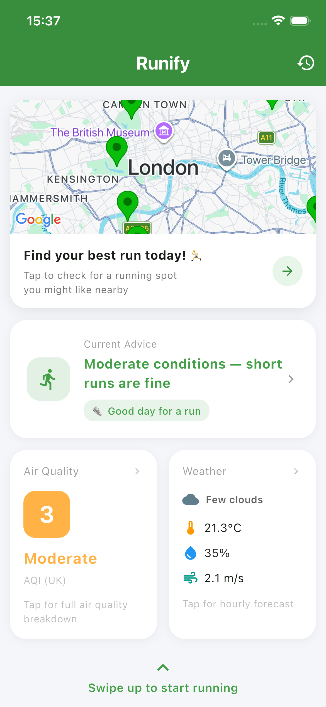
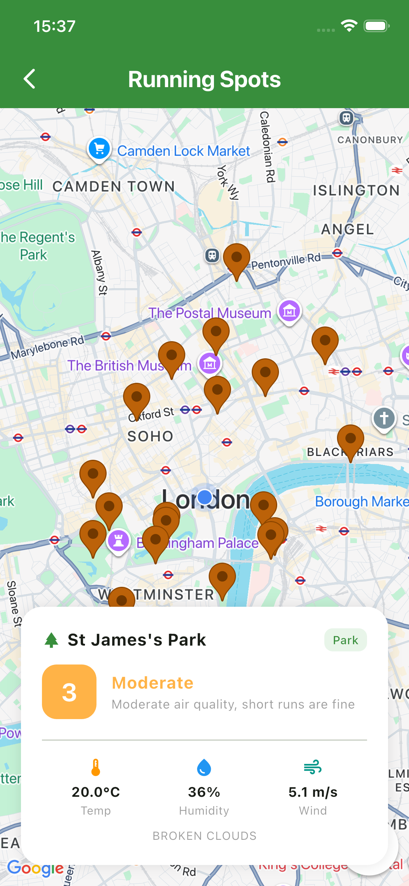
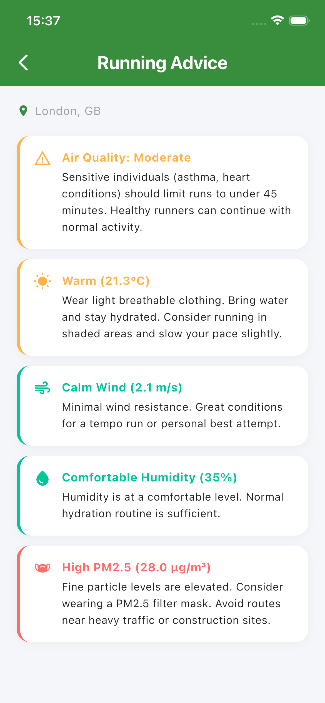
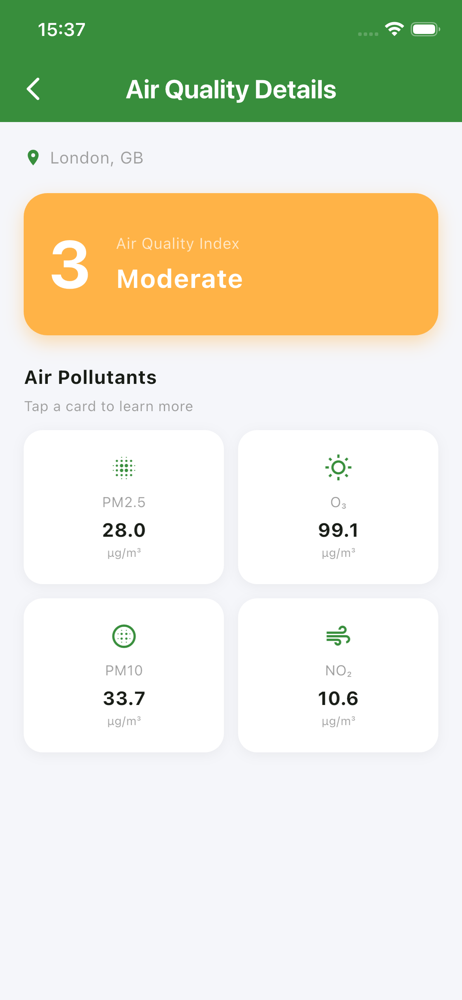
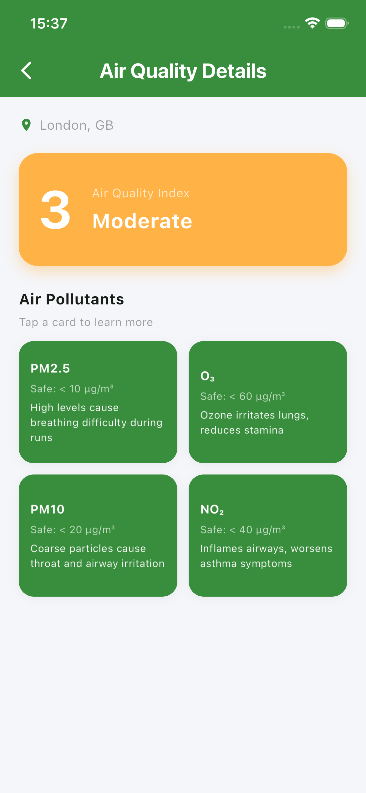
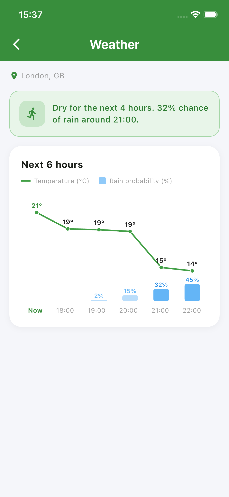
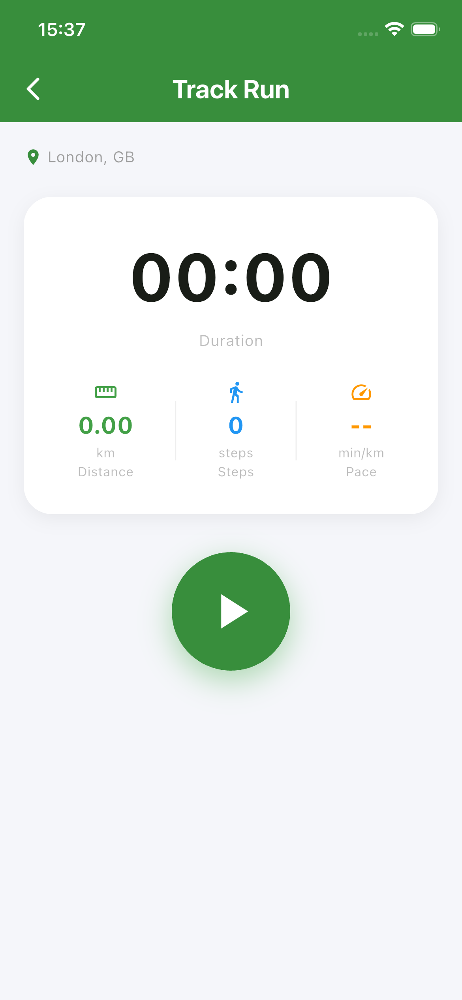
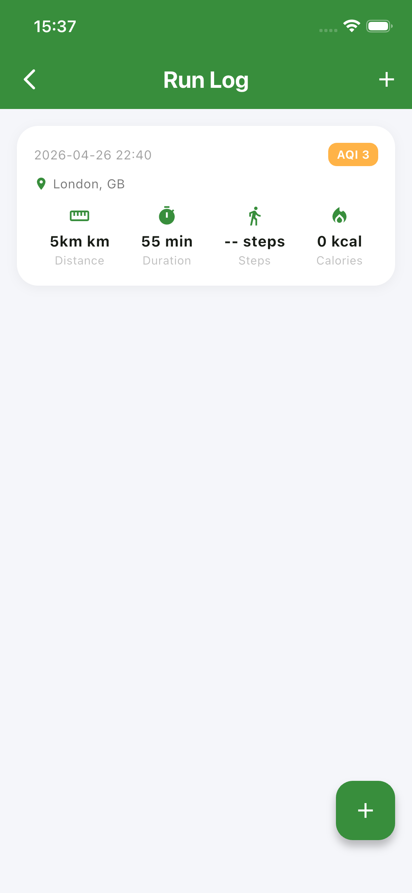

# Runify 🏃

Your all-in-one companion for urban running — decide before you go, track while you run, log when you're done.

---

## Why Runify?

Urban running sounds simple, but every time you head out, you are dealing with a series of invisible questions: how is the air quality today? Will it rain? Where nearby is suitable for a run? Once you start running, you also want to know how far you have gone, what your pace is, and how many calories you have burned. After the run, you also need somewhere to keep all of this data.

Most people deal with this by switching between three or four different apps — weather, air quality, fitness tracking, and maps — which is both inconvenient and fragmented.

Runify brings all of this together in one app. Before you go out, it helps you decide whether today is suitable for running and where nearby is best for a run. During the run, it uses the accelerometer to track steps, distance, and pace in real time. After the run, it saves the record, including the air quality at the time and calories burned.

---

## Screenshots

| | | | |
|---|---|---|---|
|  |  |  |  |

| | | | |
|---|---|---|---|
|  |  |  |  |