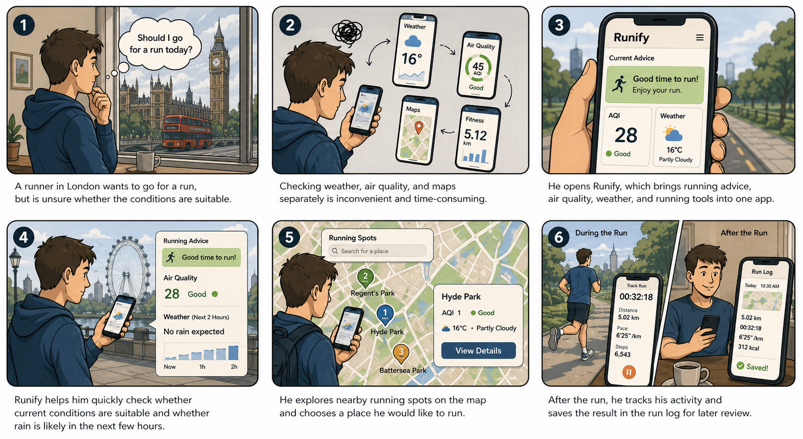

# Runify 

Your all-in-one companion for urban running — decide before you go, track while you run, log when you're done.


## 🤔 Why Runify?

Urban running sounds simple, but every time you head out, you are dealing with a series of invisible questions: how is the air quality today? Will it rain? Where nearby is suitable for a run? Once you start running, you also want to know how far you have gone, what your pace is, and how many calories you have burned. After the run, you also need somewhere to keep all of this data.

Most people deal with this by switching between three or four different apps — weather, air quality, fitness tracking, and maps — which is both inconvenient and fragmented.

Runify brings all of this together in one app. Before you go out, it helps you decide whether today is suitable for running and where nearby is best for a run. During the run, it uses the accelerometer to track steps, distance, and pace in real time. After the run, it saves the record, including the air quality at the time and calories burned.

## 🎬 Storyboard




## 📸 Screenshots

| | | | |
|---|---|---|---|
|  |  |  |  |

| | | | |
|---|---|---|---|
|  |  |  |  |

## ✨ Features

🗺️ Running Spots — Explore nearby running spots such as parks and green spaces, and quickly view their current AQI and weather conditions.

💡 Running Advice — Get clear running suggestions based on multiple factors, including AQI, temperature, wind speed, and humidity.

🌫️ Air Quality Details — Check real-time PM2.5, O₃, PM10, and NO₂ data, and tap interactive cards to see how each pollutant may affect outdoor running.

🌤️ Weather Forecast — View a 6-hour weather outlook with temperature and rainfall trends to help choose a better time to run.

🏃 Track Run — Use the phone’s accelerometer to track steps in real time and estimate distance, pace, and duration during a run.

📋 Run Log — Save each run in a simple log and estimate calories burned based on the user’s weight.

## 💻 Development Environment

- Flutter SDK 3.38.9 or higher
- Dart SDK 3.10.8 or higher
- Android Studio / VS Code
- iOS Simulator / Android Emulator or physical device

## 📦 Dependencies and APIs
**APIs**

- OpenWeatherMap API — real-time AQI, current weather, and geocoding
- Open-Meteo API — 6-hour hourly forecast (temperature + rainfall probability)
- Google Maps Flutter — interactive map display
- Google Places API — discover nearby parks, stadiums, and green spaces

**Flutter Packages**

- `geolocator: ^13.0.2` — GPS location
- `http: ^1.2.2` — API requests
- `shared_preferences: ^2.3.3` — local data persistence
- `google_maps_flutter: ^2.6.0` — map display
- `sensors_plus: ^4.0.0` — accelerometer for step counting
## 🚀 Getting Started


1. Clone the repository:

```bash
git clone https://github.com/Qing137/casa0015-mobile-assessment.git
cd casa0015-mobile-assessment
```

2. Create `lib/secrets.dart` with your API keys:

```dart
const String openWeatherApiKey = 'YOUR_KEY';
const String googleMapsApiKey = 'YOUR_KEY';
```

3. Install dependencies:

```bash
flutter pub get
```

4. Run the app:

```bash
flutter run
```
## 💭 Future Developments

- Add an AQI heatmap overlay to the map, if higher-resolution spatial data becomes available, to make area-based air quality differences easier to understand.
- Add a "best time to go out" feature to suggest more suitable running windows based on short-term weather and rainfall trends.
- Explore smarter location or route recommendation features by combining AQI and weather information.

## 📬 Contact

- Email: zczqqx4@ucl.ac.uk